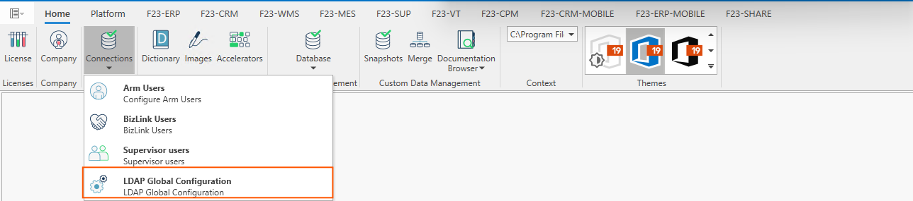
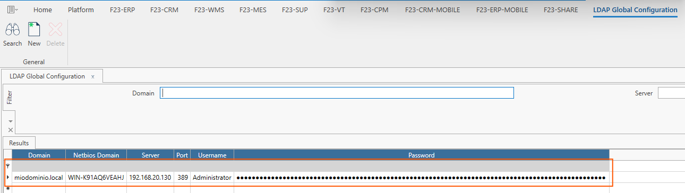
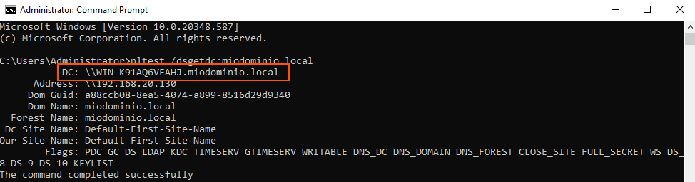
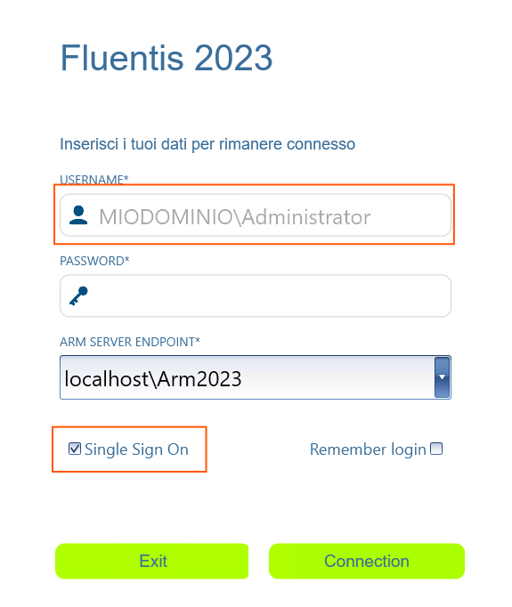

**LDAP Global Configuration** è una funzionalità dell'Application Resource Manager che permette di impostare i parametri necessari per l'autenticazione tramite **Active Directory** di Windows Server.  
**Active Directory** è un sistema server centralizzato, sviluppato da Microsoft che si fonda sui concetti di dominio e di directory, ovvero un insieme di servizi di rete, gestiti da un **domain controller**. 



*La form è così composta:*  

### Ribbon menu
Il Ribbon Menu, posto in alto della form, permette all'utente di **cercare**, **creare** ed **eliminare** i record presenti presenti nella form.   

### Filtro Standard
Il filtro standard permette all'utente di filtrare i record presenti sulla form per **dominio** e/o per **server**

### Filtro Risultati
Il filtro dei risultati mostra i risultati della griglia e si compone di:
* **Domain**: è il nome principale utilizzato per identificare l'Active Directory.   
* **NetBIOS Domain**: è una versione più corta e semplice del nome del dominio.  
* **Server**: è l'hostname del server applicativo di Fluentis.   
* **Port**: è la porta Remote Desktop Protocol (RDP), di default la 389.  
* **Username**: è il nome di utente amministratore della macchina **Windows Server**.   
* **Password**: è la password relativa all'utente di cui al punto precedente.   


Per impostare il login tramite **l'Active Directory**, è **necessario**

* Aggiungere una **nuova funzionalità** al server Windows. 
* Creare un nuovo **dominio** (oppure utilizzare uno già esistente).  
* Impostare il **controller di dominio**.  
* Impostare il server **DNS**.  
* Impostare una cartella per la base di dati di **Active Directory** e i file di **log**.  

Per ulteriori approfondimenti si rimanda alla documentazione ufficiale di Microsoft al seguente [**Link**](https://learn.microsoft.com/en-us/troubleshoot/windows-server/active-directory/active-directory-overview).  

### Trick and Tips

Per verificare il **NetBIOS Domain** è possibile, tramite il prompt, lanciare il seguente comando:

```bash
nltest /dsgetdc:<nome_dominio>

```
  


### Login a Fluentis tramite l'Active Directory  


Come illustrato in figura, è sufficiente spuntare il checkbox **Active Directory**, per poter eseguire il login.  
Fluentis recupererà automaticamente le informazioni di dominio.  

Invece, per l'importazione degli utenti in Arm tramite LDAP si rimanda al questo [**Link**](docs/arm/platform/users/import-ad.md) di guida interna. 