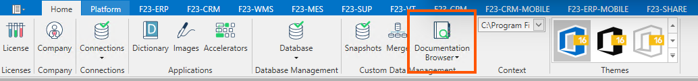
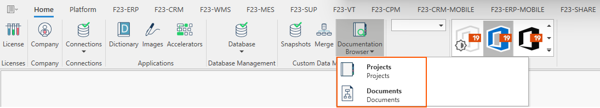
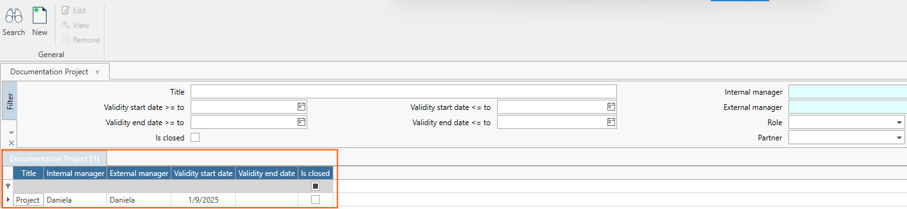
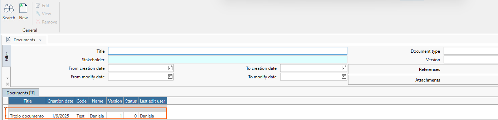
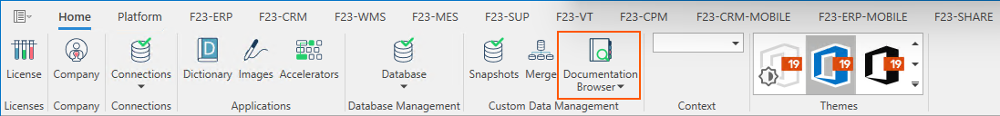
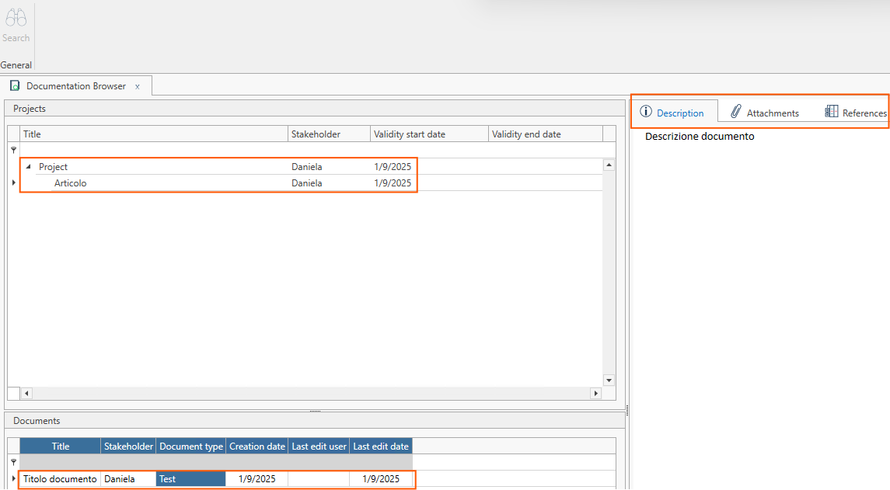

La funzionalità **Documentation Browser** messa a disposizione su Arm, permette all'utente di archiviare al'interno del gestionale Fluentis una documentazione interna che si compone di parti scritte ed allegati, utile per l'utente che ha così un punto di riferimento nell'utilizzo delle varie funzionalità dell'ERP.   

La documentazione oggetto di caricamento è organizzata secondo una gerarchia specifica, nello specifico:
I **Progetti** contengono gli **Articoli** che a loro volta contengono i singoli **Documenti**.  

Espandendo il drop-down **Documentation Browser**, troviamo due ulteriori pulsanti:
* Projects.
* Documents.

## Projects

### Ribbon menu
il **Ribbon menu** contestuale della form si compone dei pulsanti Search, New, Edit, View, Remove, e permette all'utente di interagire con la form.   

### Filtro Standard
Il **Filtro Standard** permette di filtrare i progetti per le variabili ad esso associate.  

### Griglia dei risultati
La griglia dei risultati permette all'utente di visualizzare i progetti che sono stati salvati nella base dati di Arm. Tale griglia si compone dei seguenti campi:
* **Title**: Si tratta del titolo del progetto.
* **Internal Manager**: Si tratta del manager interno del progetto.
* **External Manager**: Si tratta del manager esterno del progetto.
* **Validity Start Date**: Si tratta della data di inizio di validità del progetto.
* **Validity End Date**: Si tratta della data di fine di validità del progetto.
* **Is Closed**: Indica se il progetto è chiuso.  

## Documents 

### Ribbon menu
il **Ribbon menu** contestuale della form si compone dei pulsanti Search, New, Edit, View, Remove, e permette all'utente di interagire con la form.     

### Filtro Standard
Il **Filtro Standard** permette di filtrare i documenti per le variabili ad esso associate.  

### Griglia dei risultati
La griglia dei risultati permette all'utente di visualizzare i documenti che sono stati salvati nella base dati di Arm. Tale griglia si compone dei seguenti campi:
* **Title**: Si tratta del titolo del documento.  
* **Creation Date**: Si tratta della data di creazione del documento.  
* **Code**: Si tratta del codice del documento.   
* **Name**: Si tratta dell'utente associato al documento.  
* **Version**: Si tratta della versione del documento.  
* **Status**: Indica se il documento è aperto o chiuso.  
* **Last Edit User**: Si tratta dell'utente che ha eseguito l'ultima modifica.  

## Articoli

  

Premendo il pulsante principale **Documentation Browser**, si ha accesso alla form relativa agli **Articoli**.  

  

***La form è composta così come segue:***

### Ribbon menu 
All'interno del Ribbon menu è presente unico pulsante che permette di ricerca i progetti e documenti collegati all'interno della form.  

### Corpo Centrale
Il corpo centrale si compone di due tab laterali:
* Il tab di sinistra, che contiene i progetti e i documenti associati a ciascun progetto.  
* Il tab di destra, che contiene gli articoli associati a ciascun documento.
  * Sono inoltre presenti tre ulteriori tab che permettono di visualizzare e/o modificare il **contenuto** dell'articolo, inserire degli **allegati** e dei **riferimenti**.  

I  documenti, che compongono nel loro complesso la documentazione dovranno quindi fare riferimento ad un **Articolo** e quest'ultimo ad un **Progetto**. 
Per ogni **progetto** (possono) esistere più **articoli**, e per ogni articolo più **documenti**.  
Il primo passo sarà quindi creare un nuovo **Progetto**, per poi creare i relativi **articoli** e **documenti**.

