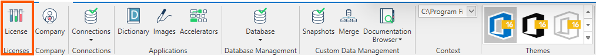
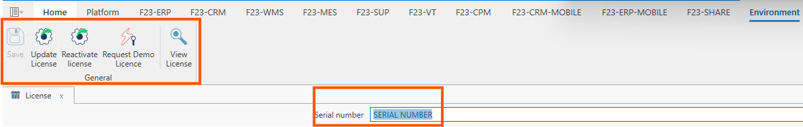
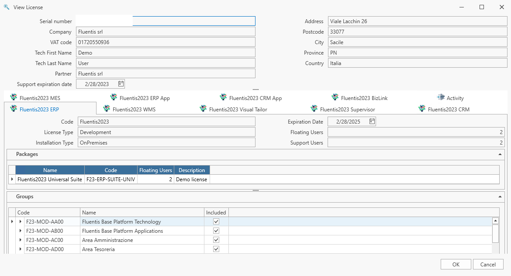

La Suite **Fluentis** viene distribuita dalla Società Fluentis S.R.L., con licenza di tipo proprietario.  
La **Licenza** è un codice alfanumerico **univoco** fornito al committente di **Fluentis S.R.L.**, che da diritto ad esso di utilizzare il gestionale in funzione dei moduli acquistati in fase di trattativa commerciale. (per esempio: ERP, CRM, MRP, WMS...).  
Si precisa che in assenza del **numero seriale di Licenza** **Fluentis** non può in alcun modo essere utilizzato.  

La form **Licenza** è costituita da un corpo centrale che mostra il numero seriale e una ribbon bar con le azione consentite all'utente.  

### Corpo centrale
* **Numero seriale:** Si tratta del numero seriale fornito alla Società committente; Ogni licenza è associata in maniera **univoca** al C.F., P.IVA e Ragione Sociale  del committente.  
Per *privacy policy* nell'immagine sopra-riportata il seriale è stato oscurato.  
* **Company:** Si tratta della Ragione Sociale della Società.   
* **VAT Code:** Si tratta del numero di iscrizione al Registro Imprese (P.IVA) che normalmente coincide con il Codice Fiscale della Società.   
* **Tech First Name:** Si tratta dell'utente di Fluentis parametrizzato in fase d'installazione direttamente dal FluentisLiveUpdate.  
* **Tech Last Name:** Si tratta dell'utente di Fluentis parametrizzato in fase d'installazione direttamente dal FluentisLiveUpdate.  
* **Partner** Si tratta della Ragione Sociale del **Partner** di Fluentis che distribuisce il software sotto Licenza proprietaria di **Fluentis S.r.l.**  
* **Support Exipiration Date*** Si tratta della data di scadenza della Licenza.
* **Address**: Sede Legale della **Società** a cui è associata la Licenza.  
* **Postcode**: CAP (Codice di avviamento postale) dell'indirizzo della Sede Legale.
* **Province**: Provincia dove si trova la Sede Legale.  
* **Country**: Nazione dove si trova la Sede Legale.  

### Corpo centrale
* Trattasi dei singoli moduli del Gestionale Fluentis (ERP, WMS, Supervisor, CRM, BizLink, MES).   

### Ribbon menu - azioni
* **Salva:** permette di salvare il numero seriale della licenza, questo da modo poi di configurare gli ambienti associati alla licenza e per ogni ambiente le applicazioni collegate.
* **Aggiorna la licenza :** da utilizzare in seguito a
    - un cambio del codice licenza;
    - un cambio del numero di utenti collegato alla licenza;
    - chiusura di un ticket lato Fluentis in seguito a una aggiunta di una nuova Società.
* **Riattivare la licenza:** Attualmente la voce non è attiva.  
* **Richiesta licenza demo:** Attualmente la voce non è attiva.  
* **Visualizza licenza:** permette di visualizzare tutti i dettagli relativi alla licenza rilasciata al cliente. Questi dettagli fanno riferimento a:
    -   Dati societari.
    -   Moduli che compongono il sistema gestionale (CRM, ERP, WMS, MES,...).
    -   Dettaglio relativo ai moduli selezionati.

