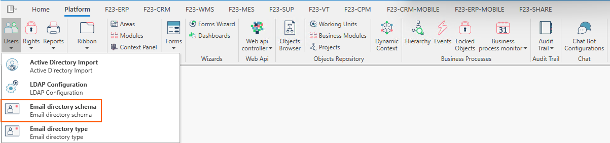
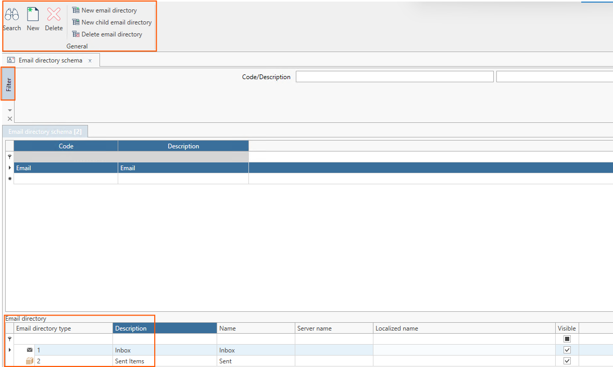

Questa form permette di definire la struttura delle cartelle che verrà visualizzata all'interno dell'applicativo Fluentis, alla sezione **Posta**.  

  

***La form si compone così com segue:***

### Ribbon menu
Il ribbon menu si compone come segue:
* Search.
* New.
* Delete.
* New email directory: permette di creare una nuova cartellina dal nodo principale.
* New child email directory: permette di creare un nuova cartellina figlio dal nodo selezionato.
* Delete email directory: permette di cancellare una nuova cartellina selezionata.  

### Filtro Standard
Il filtro permette di filtrare per **Codice** e **Descrizione**.   

### Corpo Centrale
Nel corpo centrale si trova la struttura delle cartelle della casella di posta elettronica che è possibile parametrizzare tramite i pulsanti posti sul ribbon menu.   
* Email directory type: è una combo-box che permette di scegliere il tipo di cartella tra quelli definiti nella form Arm al seguente [**Link**](docs/arm/platform/users/email-dir-type.md).  
* Description: si tratta di una descrizione presa in automatico in fase di popolamento della combo-box di cui al punto che precede.
* Name: è necessario indicare il nome della cartella della casella di posta.   
* Visibile: è un flag, che se attivato, permette di abilitare la lettura delle email da Fluentis.  
  
:::danger
***Server name non deve essere popolato.***
:::

