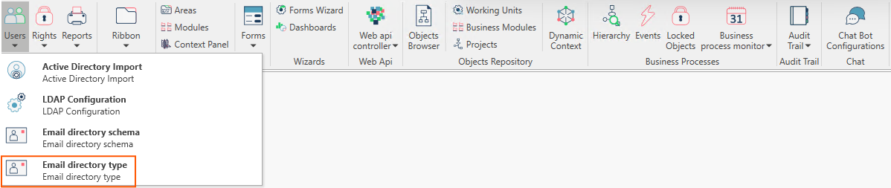
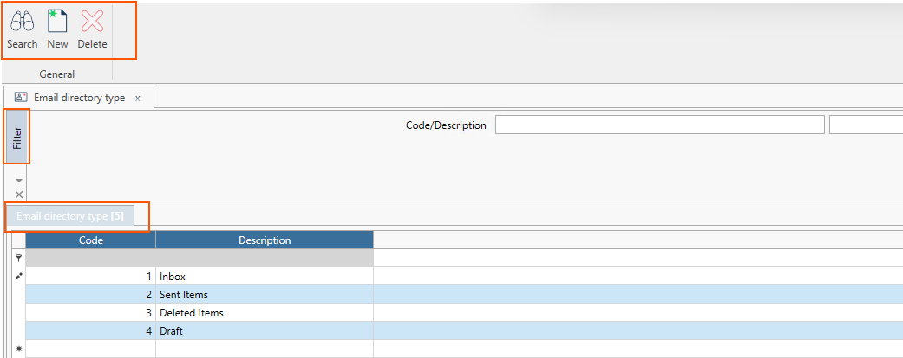
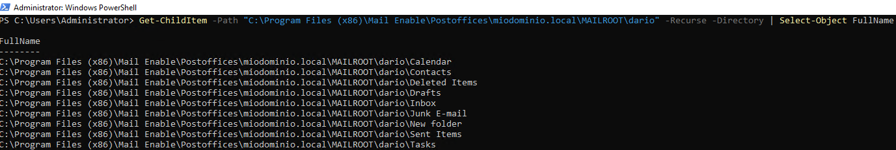

   

La form **Email Directory Type** permette di parametrizzare le cartelle relative all'indirizzo di posta elettronica.  
  

***La form si compone così come segue:***

### Ribbon menu
Il Ribbon Menu è composto da n. 3 pulsanti:
* Search.
* New.
* Delete.  
Questi pulsanti permettono all'utente di cercare, creare ed eliminare delle nuove directory per la casella di posta elettronica.  

### Filtro Standard
Il filtro standard si compone di:
* Codice
* Descrizione

### Corpo Centrale

Di default sono presenti n. 4 elementi di cui:
* Inbox.
* Sent Items.
* Deleted Items.
* Draft.

### Trick and Tips
A titolo d'esempio, per verificare la struttura delle cartelle dell'indirizzo di posta in un Server Windows è possibile tramite il powershell lanciare questo comando.  
:::danger
In questo scenario, è stato utilizzato il server di posta gratuito MailEnable.  
il comando powershell varia a seconda della tipologia di server di posta utilizzato.  
:::
  

:::danger
La struttura dell cartelle della casella di posta elettronica deve rispecchiare quanto riportato in Arm; perciò se la cartella di posta in entrata si chiama 'Inbox', anche in Arm dovrà essere presente il medesimo nome.   
:::