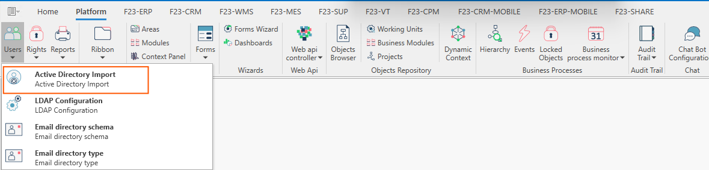
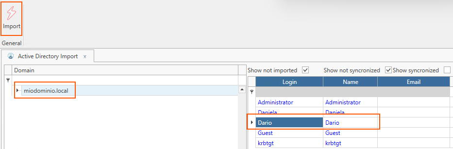
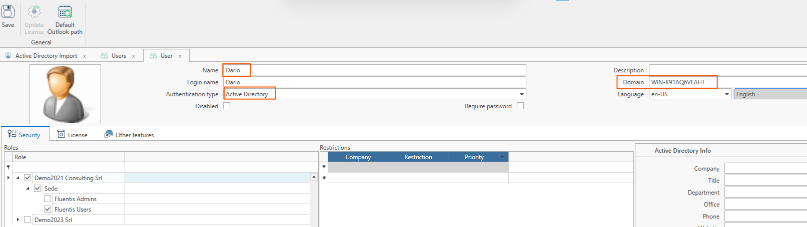
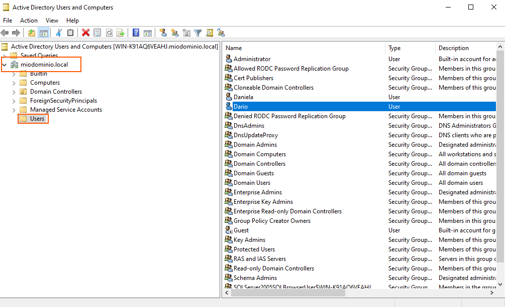

  

L'import tramite **Active Directory**, consente all'utente di Arm di importare automaticamente gli utenti definiti nel dominio Windows a livello di WorkGroup.  
:::danger Importante
Per importare gli utenti tramite **Active Directory** è necessario impostare correttamente LDAP, si rimanda a questo [**Link**](docs/arm/home/connections/connections-details\ldap.md) di documentazione interna.  
:::  

  
La form si presenta come segue:

### Ribbon Menu 
Nel ribbon menu è presente un unico pulsante denominato **Import** che serve ad eseguire l'importazione dell'utente di Windows in Arm tramite Active Directory.  

### Filtri Checkbox
* **Show not imported**.
* **Show not syncronized**.
* **Show syncronized**.

### Corpo Centrale

* Nel tab di sinistra è presente il dominio impostato nella form LDAP Configuration [**Link**](docs/arm/home/connections/connections-details\ldap.md).  
* Nel tab di destra invece sono presenti gli utenti definiti a livello di WorkGroup nel server Windows.  


## How Does It Work?

Nel tab di destra, una volta selezionato l'utente oggetto d'importazione, premere sul pulsante **Import** posto sul ribbon menu.  
L'utente verrà automaticamente importato in Arm come da figura sottostante.  

   


### Trick and Tips
Premendo la combinazione di tasti ***Windows + R*** e digitando 
```bash
dsa.msc
```
si avrà accesso alla finestra di Windows Server **Active Directory Users and Computers**.  

   


<!-- La procedura permette di sfogliare la struttura Active Directory a cui appartiene il server di ARM ed avere una lista degli utenti definiti nel Dominio Windows. Nel caso in cui il server di ARM faccia parte di un WorkGroup, tale procedura non può visualizzare alcuna informazione. Appena il server Arm verrà messo a dominio verrà in automatico rilevato l'AD.
Tramite questa procedura, una volta installato Fluentis sarà possibile importare in blocco gli utenti, i quali verrà inseriti con il ruolo Fluentis Users.

:::danger NECESSITA LDAP
Per importare gli utenti tramite active directory, [configurare correttamente LDAP](LDAP-config).
:::


La form **Importazione da Active Directory** è costituita da un corpo centrale diviso in due griglie a sinistra la lista delle unità dell'active directory e a destra la lista di utenti associati, più una ribbon bar con le possibili azioni dell'utente.

La sezione di sinistra, **Dominio**, visualizza la struttura gerarchica delle unità organizzative presente nell’Active Directory. 
Alla selezione di un nodo della struttura ad albero, la griglia contenuta nella sezione di destra visualizzerà gli utenti definiti in tale Unità Organizzativa. 
Selezionando il nodo principale, descritto con il nome DNS del dominio, verranno elencati tutti gli utenti di dominio.

La sezione di destra rappresenta gli utenti di dominio ai quali possono essere applicati dei filtri con check boxes:
* **Mostra non importati:** selezionato per default. Filtra gli utenti che non sono ancora stati importati in ARM.
* **Mostra non sincronizzati:** visualizza gli utenti che hanno delle differenze tra le informazioni in ARM e le informazioni in Active Directory.
* **Mostra utenti sincronizzati:** visualizza gli utenti che sono stati importati e che risultano correttamente sincronizzati.

La griglia utenti raccoglie le seguenti informazioni:
* **Login:** Username o Login Name specificato per l’utente.
* **Nome:** Descrizione specificata per l’utente.
* **Email:** Email dell’utente.

### Azioni
* **Importa:** per importare in arm l'utente selezionato.
 -->
