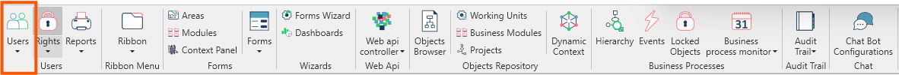

In questa sezione vengono mostrate le opzioni relative alla parametrizzazione degli utenti di **Fluentis**.  
Gli utenti nella griglia avranno accesso ai relativi moduli del gestionale in funzione della parametrizzazione effettuata.  

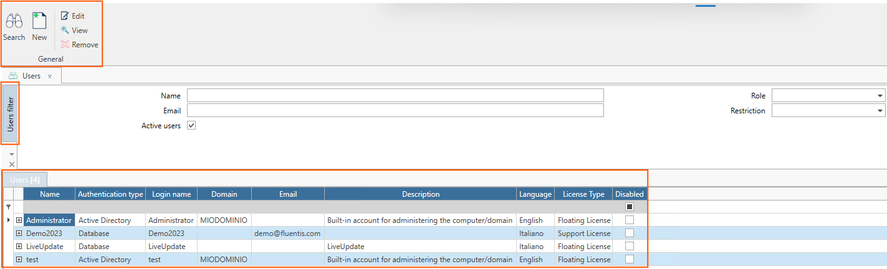

***La form principale relativa agli **Utenti** è composta così come segue***

### Ribbon menu
Il Ribbon Menu contestuale alla form permette all'utente di eseguire le seguenti azioni:
* Search.
* New.
* Edit.
* View.
* Remove. 
  
### Filtro Standard
Il filtro standard permette all'utente di filtrare la griglia dei risultati in base a dei criteri definiti, nello specifico:
* Name.
* Email.
* Role.
* Restriction.

### Griglia dei Risultati
La griglia dei risultati permette all'utente di di visualizzare gli utenti inseriti e parametrizzati per l'accesso a Fluentis.   
La griglia si compone dei seguenti campi:
* Name: Si tratta del nome completo dell'utente di Fluentis.
* Autentication Type:
* Login name:
* Domain:
* Email:
* Description:
* Language:
* License Type:
* Disabled: 

La form **Utente** è una object form composta da una serie di campi di testata e 3 Tab con le informazioni di dettaglio e una ribbon bar con le possibili azioni dell'utente.

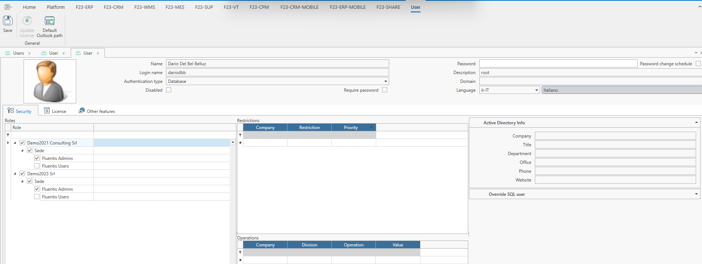

**Campi di testata**

- **Riquadro Immagine:** utilizzato per l’impostazione e visualizzazione di un’ immagine associata all’utente.
- **Nome:** nome dell'utente che si sta creando/modificando.
- **Nome login:** nome utilizzato per il login dell'utente.
- **Tipo Autenticazione:**
  - **Active Directory:** quando l’autenticazione è di Dominio/Workgroup.
  - **Database:** quando l’autenticazione viene gestita dal database.  
- **Disabilitato:** disabilita l’utente.  
- **Password obbligatoria:** rende obbligatoria la password per la login.  
- **Descrizione:** possibile descrizione legata all'utente.  
- **Dominio:** dominio legato alla login dell'utente.  
- **Lingua:** lingua utilizzata dall'utente.  

## Tabs

<!--importation for tabs-->

import Tabs from '@theme/Tabs';
import TabItem from '@theme/TabItem';

<Tabs
defaultValue="Sicurezza"
values={[
{label: 'Sicurezza', value: 'Sicurezza'},
{label: 'Licenza', value: 'Licenza'},
{label: 'Altre caratteristiche', value: 'Altrecaratteristiche'}
]}>
<TabItem value="Sicurezza">

#### Sicurezza

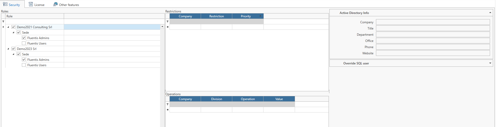

il tab **Sicurezza** contiene tutte le informazioni legate al ruolo ed eventuali restrizioni/operazioni per l’utente oggetto di parametrizzazione.

- **Ruoli:** nella parte sinistra, permette di selezionare i ruoli desiderati per l’utente in ARM e in Fluentis.  
Tali ruoli vengono definiti a livello di **Società** e **Divisione**.

- **Restrizioni:** definisce le restrizioni che l'utente avrà a livello di Business Object (es. non potrà lavorare su fatture di tipo Italia). Le Restrizioni possono essere create nella [form dedicata](../../../fluentis/objects-repository/restrictions.md) accedendovi tramite menu contestuale cliccando col tasto destro nella colonna Restrizione.

  - **Società:** specifica per quale società eseguire la Restrizione.
  - **Restrizione:** nome della Restrizione da applicare.
  - **Priorità:** ordine di priorità applicabile alle restrizioni definite.

- **Operazioni:** definisce quali operazioni può (o non può) effettuare l'utente rispetto a un determinato oggetto o a una sua proprietà. Le Operazioni possono essere create nella [form dedicata](../../../fluentis/rights/rights-details/operations.md) accedendovi tramite menu contestuale cliccando col tasto destro nella colonna Operazione.

  - **Società:** specifica per quale società eseguire la restrizione.
  - **Divisione:** specifica per quale divisione eseguire l'Operazione.
  - **Operazione:** nome dell'Operazione da applicare.
  - **Valore:** valore dell'operazione da associare all'utente.

- **Active Directory Info:** gestisce informazioni extra riguardanti l’utente recuperate dall’Active Directory. I campi extra sono _Società_, _Titolo_, _Dipartimento_, _Ufficio_, _Telefono_ e _Sito Web_.

- **Override SQL user:** permette di impostare un utente con diritti particolari per eseguire le query a DB al posto dell’utente di default definito per la connessione (Home>Connessioni). Queste credenziali verranno utilizzate anche per eseguire le query tramite Fluentis Query Studio. Per impostare l'utente specificare _Nome_ (Username), _Password_ e _Scade il_ per definire una data di scadenza delle credenziali (opzionale).

</TabItem>
<TabItem value="Licenza">

#### Licenza

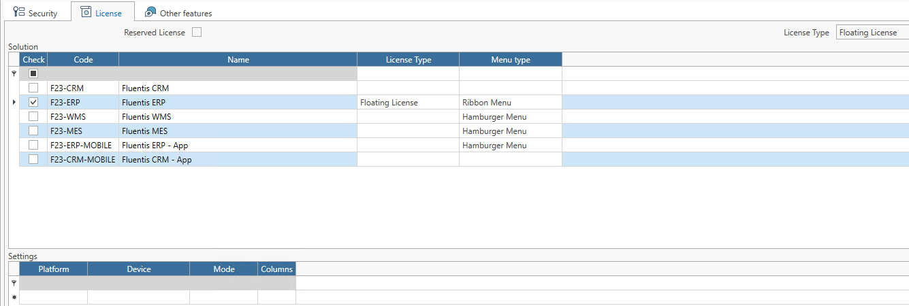

Il tab **Licenza** contiene tutte le informazioni legate alle licenza assegnate all'utente suddivise per modulo.
in testata troviamo:

- **Licenza Riservata:** riserva una delle floating license ad uno specifico utente come se fosse di tipo named
- **Tipo Licenza:**
  - **Floating License:** sono tutte le licenze standard, determinano il numero di accessi **simultaneo** consentito.
  - **Named License:** sono licenze nominali, appartengono ad una persona specifica e non possono cedute anche quando l'utente è offline.
  - **Support License:** sono le licenze per gli utenti che devono fornire supporto tecnico, possono essere definite massimo due utenze per installazione e permettono un accesso extra all’applicativo anche quando tutte le Floating License sono utilizzate dal personale.
  - **CAL License:** licenza speciale che da diritto ad un accesso parziale con contenuti specifici predefiniti.

La griglia contiene la lista di licenze disponibili che possono essere associate all’utente limitando l’accesso alle varie soluzioni di Fluentis.

| 
**_Nome_** 
 | Descrizione                                   |
| ------------------------------------------------ | --------------------------------------------- |
| _Assegno_                                        | Indica se la licenza è assegnata all'utente   |
| _Codice_                                         | Codice identificativo della licenza           |
| _Nome_                                           | Nome licenza                                  |
| _Tipo licenza_                                   | Tipo licenza da usare per la soluzione scelta |

</TabItem>
<TabItem value="Altrecaratteristiche">

#### Altre caratteristiche

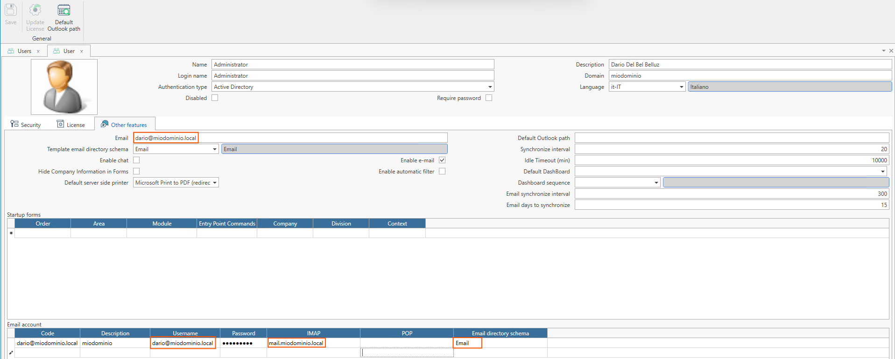

**Altre caratteristiche** contiene tutte le parametrizzazioni extra legate alla gestione della posta e delle configurazioni di avvio del profilo utente.

* **Email:** campo in cui indicare l'indirizzo completo di posta elettronica desiderato per l'utente corrente.  
* **Schema predefinito directory posta elettronica:** si tratta di una combo-box che richiama la parametrizzazione delle cartelle effettuata nella form al seguente 
* [**Link**](docs/ arm/platform/users/email-dir-scheme.md).  
* **Abilita chat:** flag che abilita l’utilizzo della Chat per l’utente corrente.  
* **Nascondi le informazioni sull'azienda nei Forms** nasconde il nome della società e della divisione nei Forms di Fluentis:

* **Abilita e-mail:** flag che abilità la sincronizzazione dell’email nel client di Fluentis.
* **Percorso predefinito per Outlook:** percorso di Exchange per indicare come agganciare il calendario utente.  
* **Sincronizza intervallo:** specificare la quantità di secondi desiderata per l’intervallo di aggiornamento della casella di posta elettronica.  
* **Timeout di inattività (min):** quantità di minuti per definire l’inattività di sincronizzazione della posta elettronica.  
* **Default DashBoard:** selezionare la dashboard di default che si desidera avviare allo startup del login dell’utente nel client di Fluentis.  
* **Sequenza delle DashBoard:** selezionare la sequenza delle dashboard da eseguire allo startup del client di Fluentis per l’utente corrente.  
* **Intervallo di sincronizzazione della posta elettronica:** indica il numero di secondi di intervallo di sincronizzazione della posta elettronica.
* **Email giorni per la sincronizzazione:** indicare il numero di giorni per i quali si vuole avere l’aggiornamento della posta elettronica, default (ultimi 15).
* **Startup forms:** tramite l’apposita griglia, è possibile indicare le forms che l’utente desidera far partire allo startup di Fluentis.

## Configurazione del server di posta
Il tab in basso permette la parametrizzazione del server di posta.  
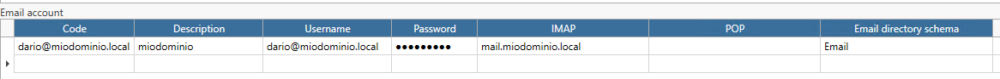

### Prerequisiti sistemistici
* Avere un server di posta **IMAP** funzionante.
  * il quale implica settare nel **DNS** un Record di tipo A ed MX.  
* Assicurarsi che la porta **IMAP** 993 sia in ascolto.  
* Abilitare l'autenticazione tramite **SSL** nel server di posta.  
* Avere a disposizione un **dominio**.

### Strumenti diagnostici
* Per verificare che il server DNS risolva correttamente l'indirizzo del server IMAP di posta elettronica.  
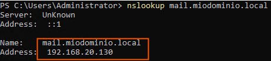

* Per verificare che il record MX del tuo dominio sia impostato correttamente puoi usare il seguente comando powershell.  
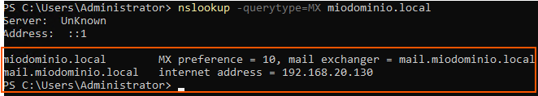

* Per verificare che la porta 993 sia in ascolto si può utilizzare il seguente comando powershell.  
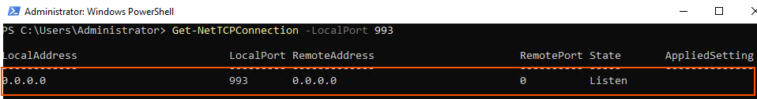

* Per verificare che il server di posta risponda correttamente puoi usare il ***telnet***  
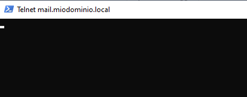

## Posta in Fluentis  
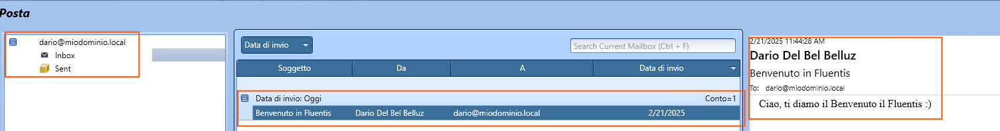

La form si divide in n. 3 tab:
* struttura delle cartelle della casella di posta elettronica.  
* messaggi.
* anteprima del messaggio.  

</TabItem>
</Tabs>
